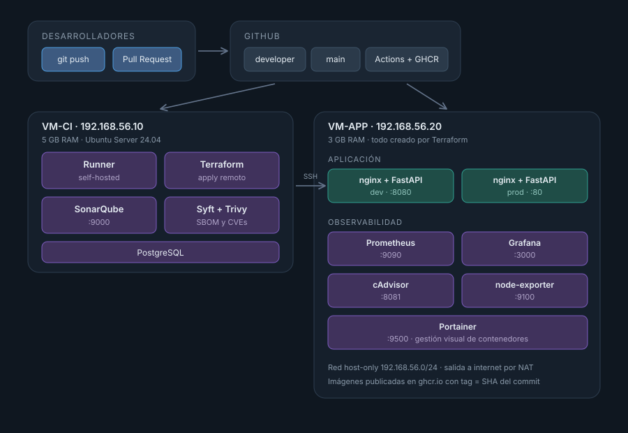

# AssetTrack

Inventario de activos de infraestructura con un pipeline de CI/CD completo, montado
sobre máquinas virtuales locales. Sin nube: todo corre en VirtualBox.

El proyecto tiene dos partes. Una es la aplicación en sí, que es deliberadamente
simple. La otra es todo lo que hay alrededor: cómo se testea, cómo se analiza, cómo
se empaqueta, cómo se despliega y cómo se monitorea. La segunda parte es la que
importa.

---
## Por qué un inventario de activos

Necesitábamos algo que se pudiera desplegar y ver funcionando en un navegador, pero
que no fuera una lista de tareas más. Elegimos un registro de servidores, servicios y
equipamiento con su responsable y su nivel de criticidad, que es exactamente lo que
la mayoría de los equipos de infraestructura maneja en una planilla que nadie
actualiza.

La razón de fondo es que esto genera métricas de negocio, no solo de tráfico.
Cualquier aplicación te da requests por segundo y latencia. Acá además tenemos
cuántos activos críticos hay y cuántos están sin responsable asignado. Un dashboard
que muestra las dos cosas juntas dice bastante más que uno con solo curvas de CPU.

La app expone:

```
GET    /                    la interfaz
GET    /api/assets          lista, filtrable por criticidad
POST   /api/assets          alta con validación
DELETE /api/assets/{id}     baja
GET    /api/stats           conteos por criticidad
GET    /api/version         entorno, commit desplegado y uptime
GET    /health              para el healthcheck del contenedor
GET    /metrics             formato Prometheus
```

Los datos viven en SQLite sobre un volumen de Docker, así que sobreviven a que se
destruya y recree el contenedor.

---

## Arquitectura



Son dos máquinas virtuales, y la separación no es caprichosa.

**VM-CI** es donde vive todo lo que construye: el runner de GitHub Actions,
SonarQube, PostgreSQL, Terraform, Syft y Trivy.

**VM-APP** es donde aterriza todo. Lo único que instalamos ahí a mano fue Docker y
el usuario `deploy`. El resto —redes, volúmenes, contenedores— lo crea Terraform
desde VM-CI a través de SSH.

Podríamos haber puesto todo en una sola VM. No lo hicimos porque entonces el
despliegue con Terraform habría sido trivial y no se vería el punto del ejercicio.
Con dos máquinas, Terraform le habla de verdad a un host remoto y el pipeline se
parece a algo que podría existir en producción.

Las dos VMs tienen dos placas de red: NAT para salir a internet y host-only en
`192.168.56.0/24` para verse entre ellas y desde la notebook.

### Stack

| Capa | Herramienta |
|---|---|
| Backend | Python 3.12 + FastAPI |
| Frontend | HTML, CSS y JavaScript sin frameworks, servido por nginx |
| Contenedores | Docker con buildx, imágenes multi-stage |
| Registry | GitHub Container Registry (ghcr.io) |
| IaC | Terraform con el provider kreuzwerker/docker |
| CI/CD | GitHub Actions con runner self-hosted |
| Calidad | SonarQube Community |
| SBOM | Syft (CycloneDX y SPDX) |
| Vulnerabilidades | Trivy |
| Monitoreo | Prometheus + Grafana + cAdvisor + node-exporter |
| Gestión visual | Portainer |

---

## El flujo de trabajo

```
desarrollador → push a developer → pipeline → dev en :8080
                                                  ↓
                                          Pull Request
                                                  ↓
                              merge a main → pipeline → prod en :80
```

Las dos ramas despliegan, a destinos distintos. Si solo `main` desplegara,
`developer` sería decorativa.

Los dos entornos conviven en VM-APP con recursos separados: contenedores con sufijo
`-dev` y `-prod`, redes distintas, volúmenes distintos. Los activos que cargás en dev
no aparecen en prod, y eso es correcto.

El pipeline está armado como un workflow reutilizable (`workflow_call`) más dos
callers de veinte líneas que solo cambian el entorno, el puerto y si los gates
bloquean o no. Sin eso serían doscientas líneas duplicadas.

### Qué hace cada corrida

1. Instala dependencias en un venv y corre los 11 tests con cobertura
2. Manda el análisis a SonarQube y espera el quality gate
3. Construye las dos imágenes con buildx y las publica en GHCR, etiquetadas con el
   SHA del commit
4. Genera cuatro SBOMs con Syft (CycloneDX y SPDX, backend y frontend) y los deja
   como artefactos descargables
5. Escanea las imágenes con Trivy
6. Corre `terraform init`, `plan` y `apply` contra VM-APP
7. Hace un smoke test contra `/api/version` con reintentos

El tag por SHA hace que cada despliegue sea trazable hasta el commit
exacto, y que un rollback sea reaplicar Terraform con un SHA anterior.

---

## Controles de seguridad

Hay dos, y funcionan distinto en cada entorno.

En `developer` los gates son informativos: analizan, reportan y dejan pasar. La idea
es poder iterar rápido. En `main` bloquean.

**SonarQube** analiza el código y evalúa un quality gate. El gate por defecto de
SonarQube implementa "Clean as You Code", pensado para equipos que arrancan con la
herramienta desde el día uno del proyecto. En un repositorio donde todo el código es
nuevo, la condición `new_violations > 0` bloquea cualquier despliegue por un code
smell menor. Lo reemplazamos por un criterio basado en ratings agregados: el gate
falla si la fiabilidad o la seguridad caen a D o E, que son problemas reales y no
ruido de estilo.

**Trivy** escanea las imágenes. Corre dos veces: una que reporta todo lo HIGH y
CRITICAL sin bloquear, y otra que sí detiene el pipeline, pero solo ante CRITICAL con
fix disponible. La distinción importa. Las imágenes base suelen arrastrar CVEs sin
parche upstream, y si bloquearas por eso el pipeline quedaría rojo permanentemente
por algo que no podés arreglar. A la semana estarías ignorando el gate, y un control
que siempre falla no es un control.

**Experiencia durante la práctica:** Trivy encontró **CVE-2026-31789**, un heap buffer
overflow en OpenSSL con severidad crítica, en la imagen base del frontend
(`nginx:1.27-alpine`, con `libssl3 3.3.3-r0`). El gate detuvo el despliegue a
producción. Se resolvió actualizando la base a `nginx:1.29-alpine`, que trae OpenSSL
parcheado. El despliegue se completó recién después de corregir la vulnerabilidad.

Ese ciclo completo —detección, bloqueo, remediación, verificación— vale más que un
pipeline que nunca encontró nada.

Además, dos decisiones de diseño que suman:

- El backend no publica ningún puerto público. Solo nginx expone el 8080 (o el 80).
  FastAPI vive dentro de la red de Docker y únicamente se alcanza a través del proxy.
  El endpoint `/metrics` se publica en `127.0.0.1` para que Prometheus llegue, pero
  desde fuera de la VM sigue siendo inalcanzable.
- El contenedor del backend corre como usuario sin privilegios (UID 10001), no como
  root.

---

## Monitoreo

Un solo Prometheus scrapea los dos entornos, con los targets etiquetados
`environment=dev` y `environment=prod`. Duplicar el stack por entorno habría dado dos
Grafanas aislados y unos 400 MB más de RAM en una VM que tiene tres. Así se ven las
dos series en el mismo panel, que además es más útil.

El stack de monitoreo tiene estado de Terraform propio y se aplica a mano. Es
infraestructura de plataforma: su ciclo de vida no tiene nada que ver con el de la
aplicación, que se redespliega en cada commit.

El dashboard tiene tres bloques:

- **Negocio**: activos por criticidad, distribución, activos sin responsable
- **Aplicación**: requests por segundo y latencia p95, separados por entorno
- **Infraestructura**: CPU, memoria y disco del host; CPU y memoria por contenedor

---

## Servicios

| Servicio | Dirección | Credenciales |
|---|---|---|
| AssetTrack producción | http://192.168.56.20 | — |
| AssetTrack dev | http://192.168.56.20:8080 | — |
| Grafana | http://192.168.56.20:3000 | admin / assettrack |
| Prometheus | http://192.168.56.20:9090 | — |
| cAdvisor | http://192.168.56.20:8081 | — |
| Portainer | http://192.168.56.20:9500 | se define al primer acceso |
| SonarQube | http://192.168.56.10:9000 | admin |

Usuario de las VMs: `deploy`.

---

## Montarlo desde cero

### 1. Las máquinas virtuales

| | VM-CI | VM-APP |
|---|---|---|
| SO | Ubuntu Server 24.04 | Ubuntu Server 24.04 |
| RAM | 5 GB | 3 GB |
| vCPU | 2 | 2 |
| Disco | 40 GB | 20 GB |
| IP host-only | 192.168.56.10 | 192.168.56.20 |

Marcá "Install OpenSSH server" durante la instalación. Y tomá un snapshot apenas
termines de instalar Docker: cuando rompas algo probando Terraform, volvés en diez
segundos.

Un detalle del instalador de Ubuntu que nos costó tiempo: aunque le des 40 GB al
disco, el volumen lógico se crea usando solo una parte. Se arregla con
`sudo lvextend -l +100%FREE /dev/ubuntu-vg/ubuntu-lv` y `sudo resize2fs`.

### 2. Red en VirtualBox

Con las VMs apagadas, desde la notebook:

```bash
VBoxManage hostonlyif create
VBoxManage hostonlyif ipconfig vboxnet0 --ip 192.168.56.1 --netmask 255.255.255.0
VBoxManage dhcpserver modify --ifname vboxnet0 --disable

VBoxManage modifyvm "VM_CI"  --nic2 hostonly --hostonlyadapter2 vboxnet0
VBoxManage modifyvm "VM-APP" --nic2 hostonly --hostonlyadapter2 vboxnet0
```

Dentro de cada VM, IP fija por netplan sobre la segunda placa (`enp0s8`), sin
gateway: la salida a internet tiene que seguir yendo por el NAT.

```yaml
network:
  version: 2
  ethernets:
    enp0s8:
      dhcp4: false
      addresses: [192.168.56.10/24]
```

### 3. Acceso de Terraform a VM-APP

Terraform corre en VM-CI y crea contenedores en VM-APP a través de SSH. Para eso
necesita entrar sin contraseña. Desde VM-CI:

```bash
ssh-keygen -t ed25519 -C "runner@vm-ci" -f ~/.ssh/id_ed25519 -N ""
ssh-copy-id deploy@192.168.56.20
docker -H ssh://deploy@192.168.56.20 ps
```

Si ese último comando devuelve la tabla de contenedores, la parte difícil está hecha.
Es literalmente lo que Terraform ejecuta por debajo.

Como el runner es self-hosted y corre en VM-CI, la clave privada ya está en el disco
de la máquina que la necesita. No hace falta subirla como secret a GitHub, lo cual es
más seguro que el enfoque habitual.

### 4. Stack de CI

En VM-CI, antes de levantar SonarQube:

```bash
echo "vm.max_map_count=262144" | sudo tee /etc/sysctl.d/99-sonarqube.conf
sudo sysctl --system
```

Sin eso, el Elasticsearch embebido no arranca y el error no dice nada útil.

Después:

```bash
cd ~/ci-stack
echo "POSTGRES_PASSWORD=$(openssl rand -base64 24)" > .env
docker compose up -d
```

Tarda entre dos y cinco minutos la primera vez.

### 5. Runner

Ubuntu Server no trae `unzip` ni `python3-venv`, y el pipeline los necesita:

```bash
sudo apt install -y unzip python3-venv python3-pip jq
```

El runner se registra desde Settings → Actions → Runners del repositorio, con las
labels `self-hosted, Linux, X64, vm-ci`. Instalalo como servicio, no con `run.sh`:

```bash
sudo ./svc.sh install deploy
sudo ./svc.sh start
```

El `deploy` del final importa: hace que el servicio corra con el usuario que tiene la
clave SSH hacia VM-APP.

### 6. Secrets

En Settings → Secrets and variables → Actions:

| Secret | Valor |
|---|---|
| `SONAR_TOKEN` | token de análisis global de SonarQube |
| `SONAR_HOST_URL` | http://192.168.56.10:9000 |

El push a GHCR usa el `GITHUB_TOKEN` automático, no hace falta configurar nada más.
Eso sí, Settings → Actions → General tiene que estar en "Read and write permissions".

### 7. Monitoreo

Se aplica una vez, a mano, desde VM-CI:

```bash
sudo mkdir -p /opt/tfstate/monitoring && sudo chown deploy:deploy /opt/tfstate/monitoring
cd terraform/monitoring
terraform init -backend-config="path=/opt/tfstate/monitoring/terraform.tfstate"
terraform apply
```

---

## Estructura del repositorio

```
backend/            FastAPI, tests, Dockerfile multi-stage
frontend/           HTML, nginx.conf, Dockerfile
terraform/          infraestructura de la aplicación
  envs/             tfvars por entorno
  monitoring/       stack de observabilidad, estado separado
monitoring/         prometheus.yml y provisioning de Grafana
.github/workflows/  reusable-deploy.yml + los dos callers
docs/               diagramas y evidencias
```

El estado de Terraform no vive en el repositorio ni en el workspace del runner (que
se limpia en cada corrida), sino en `/opt/tfstate/{dev,prod,monitoring}/` dentro de
VM-CI. Los archivos `.tfstate` pueden contener credenciales en texto plano, así que
están en el `.gitignore`.


---

## Entregables

- Workflows de GitHub Actions: `.github/workflows/`
- Archivos de Terraform: `terraform/` y `terraform/monitoring/`
- Dockerfiles y artefactos publicados en `ghcr.io/alebeier/assettrack-{backend,frontend}`
- SBOMs en CycloneDX y SPDX, disponibles como artefactos de cada ejecución del pipeline
- Capturas del dashboard y de las corridas: `docs/evidencias/`

